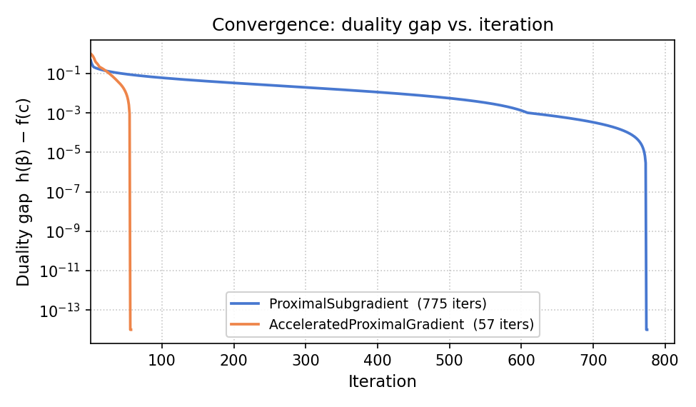

# maximin

[](https://github.com/rwilson4/Maximin/actions/workflows/ci.yml)

Robust optimization solver for maximin problems of the form:

```
maximize_c  minimize_beta  g(c; beta)
subject to  beta in S
            c in C
            r_k(c; gamma_k) >= 0  for all gamma_k in T_k,  k = 1, ..., K
```

`c` is a decision variable (what you control), `beta` is an uncertain parameter
known only to lie in an uncertainty set `S`, and `C` is the feasible set for
decisions. The optional **robust constraints** `r_k(c; gamma_k) >= 0` must hold
for every `gamma_k` in a second uncertainty set `T_k`, independently of the
objective uncertainty.

The library returns a decision `c` that maximizes the **worst-case** outcome
over all `beta` in `S`, subject to the constraints holding robustly.

Iterative solvers expose per-iteration duality gaps — a certificate that the
current solution is within `h(β) − f(c)` of optimal — and a built-in
convergence plot:



## Why maximin?

Maximin problems arise naturally when making decisions under adversarial or
distributional uncertainty:

- **Robust portfolio allocation**: allocate a budget across assets when expected
  returns are uncertain; maximize the worst-case return over a confidence
  ellipsoid derived from historical data.
- **Resource allocation with uncertain impact**: distribute resources across
  programs when impact elasticities are estimated from data; protect against
  parameter estimation error.
- **Zero-sum games**: find the optimal strategy in a matrix game where an
  adversary picks the worst-case response.
- **Robust feasibility constraints**: require `r(c; gamma) >= 0` for all
  `gamma` in a confidence set — for example, guaranteeing that a capacity or
  budget constraint holds even under adverse parameter realizations.

### How does it compare with other tools?

| Tool | Minimax support | Uncertainty sets | Notes |
|---|---|---|---|
| **maximin** | Native | Ellipsoid, Hypercube, Binomial, Poisson, Gamma, ... | Purpose-built; no manual reformulation |
| **cvxpy** | Manual reformulation | None | Powerful general solver; MatrixGame+Ellipsoid requires a non-trivial SOCP reformulation |
| **scipy.optimize** | None | None | Requires a custom outer loop + inner solver per gradient step |
| **gurobipy / CPLEX** | Manual reformulation | None | Commercial; flexible but verbose setup |

For the common case of a **matrix game with an ellipsoidal uncertainty set and
a budget-constrained allocation**, maximin provides an exact SOCP solver
(`MarkowitzSolver`) that returns the globally optimal solution in milliseconds.
For general outcome models, iterative solvers with closed-form gradients are
available.

## Installation

```bash
pip install maximin
```

## Quick start

### Matrix game with ellipsoidal uncertainty

The most common use case: allocate a budget across `m` options when the expected
payoffs `beta` are uncertain, modeled as an ellipsoidal confidence region.

```python
import numpy as np
from maximin import (
    AllocationDecision,
    Ellipsoid,
    MarkowitzSolver,
    MatrixGame,
)

# Payoff matrix A: outcome is g(c; beta) = c^T A beta
#   m=3 allocation options, n=2 uncertain parameters
A = np.array([[1.0, 0.5],
              [0.3, 0.8],
              [0.6, 0.6]])

# Ellipsoidal uncertainty set: (beta - beta_hat)^T Sigma^-1 (beta - beta_hat) <= 1
beta_hat = np.array([1.0, 1.0])
Sigma = 0.01 * np.eye(2)
region = Ellipsoid(beta_hat, Sigma)

# Decision space: budget allocation  {c >= 0, sum(c) <= 1}
space = AllocationDecision(3)

# Exact global optimum via SOCP
game = MatrixGame(A)
result = MarkowitzSolver(game, region, space).solve(np.zeros(3))
print(result)
# Converged after 1 iterations. Objective: 1.2293
```

`result.objective` is the guaranteed worst-case payoff: regardless of which
`beta` in the ellipsoid nature selects, you earn at least that value.
`result.x` is the optimal allocation.

### Matrix game with ellipsoidal uncertainty and robust constraints

Robust constraints require a side condition `r(c; gamma) >= 0` to hold for
**every** `gamma` in a second uncertainty set `T`, independently of the
objective uncertainty. For a matrix game constraint `r(c; gamma) = c^T B gamma`
and an ellipsoidal `T`, the worst case over `T` has a closed form and the
combined problem remains an SOCP:

```python
import numpy as np
from maximin import (
    AllocationDecision,
    ConstrainedMarkowitzSolver,
    Ellipsoid,
    MatrixGame,
    MatrixGameEllipsoidRobustConstraint,
)

# Objective: maximize worst-case c^T A beta over S
A = np.array([[1.0, 0.5],
              [0.3, 0.8],
              [0.6, 0.6]])
game = MatrixGame(A)
region = Ellipsoid(np.array([1.0, 1.0]), 0.01 * np.eye(2))   # S for beta
space = AllocationDecision(3)

# Constraint: c^T B gamma >= 0 for all gamma in T
# e.g., a robustified lower bound on a secondary payoff
B = np.array([[0.5, 0.2],
              [0.1, 0.6],
              [0.4, 0.4]])
T = Ellipsoid(np.array([0.3, 0.3]), 0.02 * np.eye(2))        # T for gamma
constraint = MatrixGameEllipsoidRobustConstraint(B, T)

result = ConstrainedMarkowitzSolver(
    game, region, space, [constraint]
).solve(np.zeros(3))
print(result)

# Verify constraint is satisfied at the optimum
print(constraint.infimum(result.x))    # >= 0
print(constraint.worst_case_gamma(result.x))
```

Multiple constraints can be passed as a list. Each has its own `B`, `T`, and
uncertainty set, independent of the objective's `A` and `S`. When the
constraint list is empty, `ConstrainedMarkowitzSolver` reduces to
`MarkowitzSolver`.

### Matrix game with box uncertainty

When each parameter has known interval bounds, an exact LP solver is available:

```python
from maximin import Hypercube, MaximinLinearSolver

lo = np.array([0.8, 0.9])
hi = np.array([1.2, 1.1])
region = Hypercube(lo, hi)

result = MaximinLinearSolver(game, region, space).solve(np.zeros(3))
```

### Cobb-Douglas model with ellipsoidal uncertainty

For outcome models with a closed-form dual but no exact reformulation, use the
accelerated proximal gradient solver:

```python
import numpy as np
from maximin import (
    AcceleratedProximalGradientDualSolver,
    AllocationDecision,
    CobbDouglas,
    CobbDouglasEllipsoidDualObjective,
    Ellipsoid,
)

m = 3  # number of programs
# g(c; beta) = exp(beta_0) * prod_i (delta_i + gamma_i c_i)^beta_i
model = CobbDouglas(m)

# beta = [log-baseline, elasticity_1, elasticity_2, elasticity_3]
beta_hat = np.array([0.0, 0.3, 0.4, 0.3])
Sigma = 0.01 * np.eye(4)
region = Ellipsoid(beta_hat, Sigma)
space = AllocationDecision(m)

obj = CobbDouglasEllipsoidDualObjective(model, region)
solver = AcceleratedProximalGradientDualSolver(obj, space, max_iter=2000)

c0 = np.ones(m) / m  # uniform initial allocation
result = solver.solve(c0)
print(result)
```

### Statistical confidence regions

Uncertainty sets can be derived directly from data likelihoods. For example,
if successes are Binomial-distributed, use `BinomialRegion`:

```python
from maximin import BinomialRegion

# 80 successes out of 100 trials; 95% confidence level
region = BinomialRegion(n_trials=100, n_successes=80, confidence=0.95)
```

Analogous classes exist for Poisson, Gamma, and Huber-robust criteria.

## Building blocks

Maximin is built from four composable components. Mix and match to fit your
problem.

### Outcome models

| Class | Formula | Use case |
|---|---|---|
| `MatrixGame(A)` | `c^T A beta` | Linear payoff |
| `CobbDouglas(m)` | `exp(beta_0) prod_i (delta_i + gamma_i c_i)^beta_i` | Resource allocation with elasticities |

Implement `OutcomeModel` to add your own: provide `evaluate`, `grad_c`,
and `grad_beta`.

### Confidence regions (uncertainty sets)

| Class | Set | Typical source |
|---|---|---|
| `Ellipsoid(beta_hat, Sigma)` | `{(beta-b)^T Sigma^-1 (beta-b) <= 1}` | Gaussian/LRT confidence region |
| `Hypercube(lo, hi)` | `{lo <= beta <= hi}` | Interval uncertainty |
| `BinomialRegion(n, k, confidence)` | LRT region for Binomial likelihood | Binary outcomes |
| `PoissonRegion(n, k, confidence)` | LRT region for Poisson likelihood | Count data |
| `GammaRegion(n, sum_x, confidence)` | LRT region for Gamma likelihood | Positive continuous outcomes |
| `HuberCriterionRegion(...)` | Huber robust criterion region | Outlier-robust estimation |

Implement `ConfidenceRegion` to add your own: provide `project`, `contains`,
and `dim`.

### Decision spaces

| Class | Set | Use case |
|---|---|---|
| `AllocationDecision(m)` | `{c >= 0, sum(c) <= 1}` | Budget allocation |

Implement `DecisionSpace` to add your own: provide `project`, `contains`,
and `dim`.

### Solvers

| Solver | Method | Best for |
|---|---|---|
| `MarkowitzSolver` | Exact SOCP (Clarabel) | `MatrixGame + Ellipsoid + AllocationDecision` |
| `ConstrainedMarkowitzSolver` | Exact SOCP (Clarabel) | Same, plus robust constraints |
| `MaximinLinearSolver` | Exact LP (HiGHS) | `MatrixGame + Hypercube + AllocationDecision` |
| `AcceleratedProximalGradientDualSolver` | FISTA, O(1/k²) | Smooth dual objectives |
| `ProximalSubgradientDualSolver` | Projected subgradient, O(1/√k) | General dual objectives |
| `ProximalSubgradientPrimalSolver` | Projected subgradient | Primal path (min over beta) |

**Choosing a solver:**

1. If your problem fits `MatrixGame + Ellipsoid + AllocationDecision`, use
   `MarkowitzSolver` — it finds the exact global optimum.
2. If you also need robust constraints, use `ConstrainedMarkowitzSolver` with
   a list of `MatrixGameEllipsoidRobustConstraint` objects.
3. If your problem fits `MatrixGame + Hypercube + AllocationDecision`, use
   `MaximinLinearSolver`.
4. For other combinations with a differentiable dual objective, use
   `AcceleratedProximalGradientDualSolver` — it converges at O(1/k²).
5. For non-smooth dual objectives, use `ProximalSubgradientDualSolver`.

All iterative solvers accept `max_iter`, `tol`, and `step_size` parameters and
return a `SolverResult` dataclass with fields `x`, `objective`, `n_iterations`,
and `converged`.

### Robust constraints

A `RobustConstraint` represents `inf_{gamma in T} r(c; gamma) >= 0`: a side
condition on `c` that must hold for every `gamma` in an uncertainty set `T`.
Because the infimum of a family of concave-in-`c` functions is concave, the
constraint is convex and compatible with the SOCP solvers.

| Class | Constraint | Formula for `q(c)` |
|---|---|---|
| `MatrixGameEllipsoidRobustConstraint(B, T)` | `c^T B gamma >= 0` for all `gamma in T` | `c^T B γ̂ − ‖Σ_T^{1/2} B^T c‖₂` |

The constraint's `B` matrix (shape `m × p`) and uncertainty set `T`
(an `Ellipsoid` of dimension `p`) are fully independent of the objective's
`A` and `S` — they can have different sizes and covariances.

Key methods on `MatrixGameEllipsoidRobustConstraint`:

- `infimum(c)` — evaluates `q(c)`; the constraint is satisfied when this is ≥ 0.
- `worst_case_gamma(c)` — returns `γ*(c) = argmin_{γ ∈ T} c^T B γ`.
- `is_satisfied(c, atol=0.0)` — convenience check `q(c) >= -atol`.

Implement `RobustConstraint` to add constraints with other structure: provide
`dim_c`, `infimum`, and `worst_case_gamma`.

### Problem objectives (dual and primal)

Iterative solvers operate on an objective function rather than directly on the
outcome model. For supported combinations there are closed-form objectives:

| Class | Combination | Formula |
|---|---|---|
| `MatrixGameEllipsoidDualObjective` | `MatrixGame + Ellipsoid` | `c^T A b - \|\|Sigma^{1/2} A^T c\|\|` |
| `CobbDouglasEllipsoidDualObjective` | `CobbDouglas + Ellipsoid` | Closed form via log-concavity |

For any other combination, use `DefaultDualObjective` or
`DefaultPrimalObjective`, which solve the inner optimization numerically at
each gradient step.
